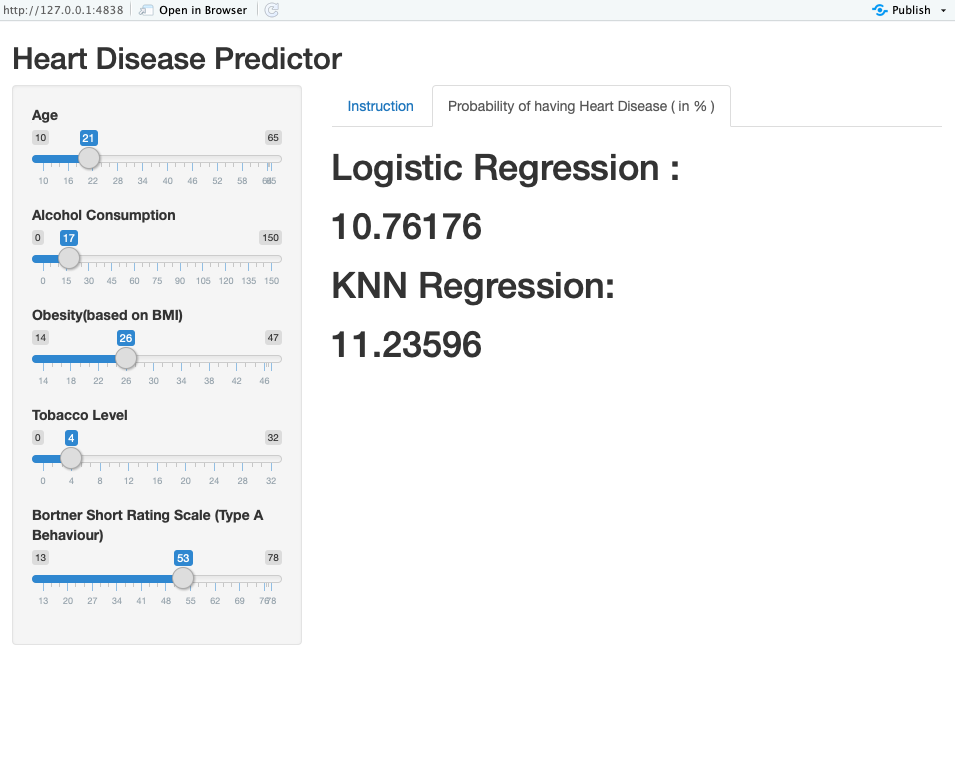

# Heart-Disease-Predictor
## This Application predicts Heart Disease by using different models. Here, The data is used from SAheart which resides within ElemStatLearn Libarary. Shiny is used for web application. Logistic and KNN Regression are the models to train the data.

```
Shiny is an R package that makes it easy to build interactive web apps 
straight from R. You can host standalone apps on a webpage or embed them
in R Markdown documents or build dashboards. You can also extend your 
Shiny apps with CSS themes, htmlwidgets, and JavaScript actions.
```

# First Look of Shiny Web Application


